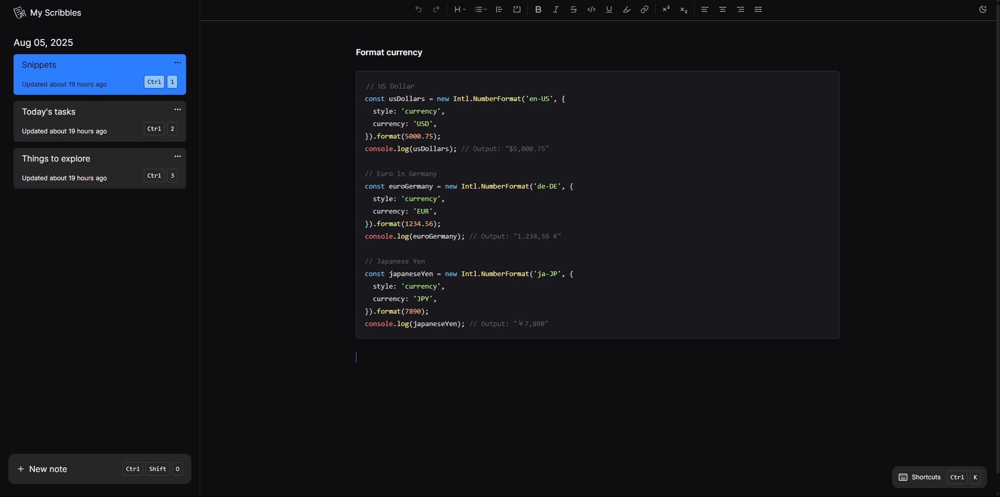

# Scribble

Chrome extension to take quick notes in new tab



### Features

- ✨ Rich text editor with syntax highlighting for code
- ⏩ Shortcuts for quick actions
- 🎉 Accessible
- 💻 Data stored locally
- ✅ Works offline
- 🌗 Light and dark mode

### Installation

- Download or clone the repository
- Install dependencies

```sh
pnpm install
```

- Build project

```sh
pnpm build
```

- Open Chrome and navigate to `chrome://extensions/`
- Enable "Developer mode" by toggling the switch in the top right corner
- Click "Load unpacked" and select the `dist` directory that is generated after the build process
- The extension should now be active (Check by opening a new tab)
